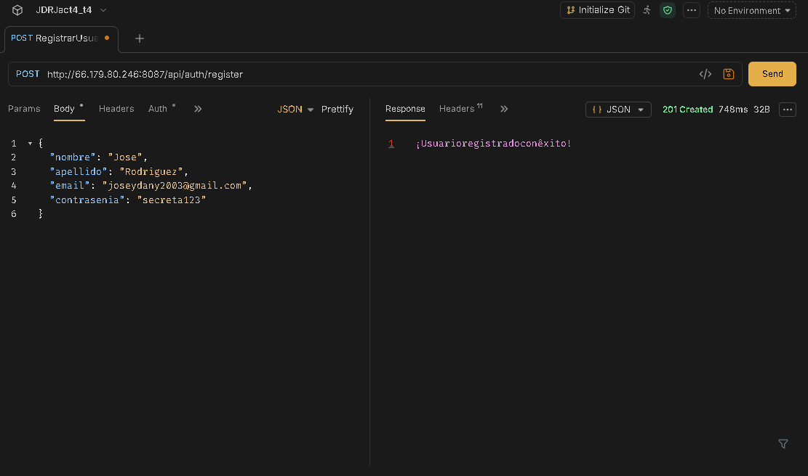
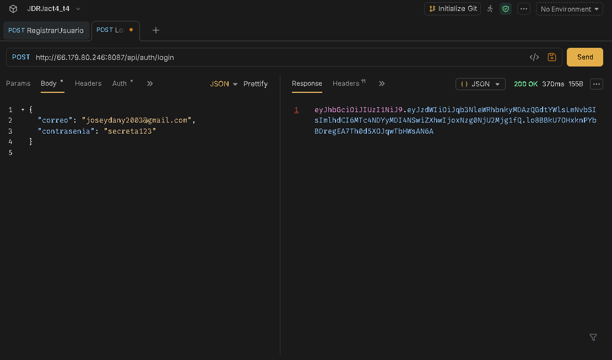
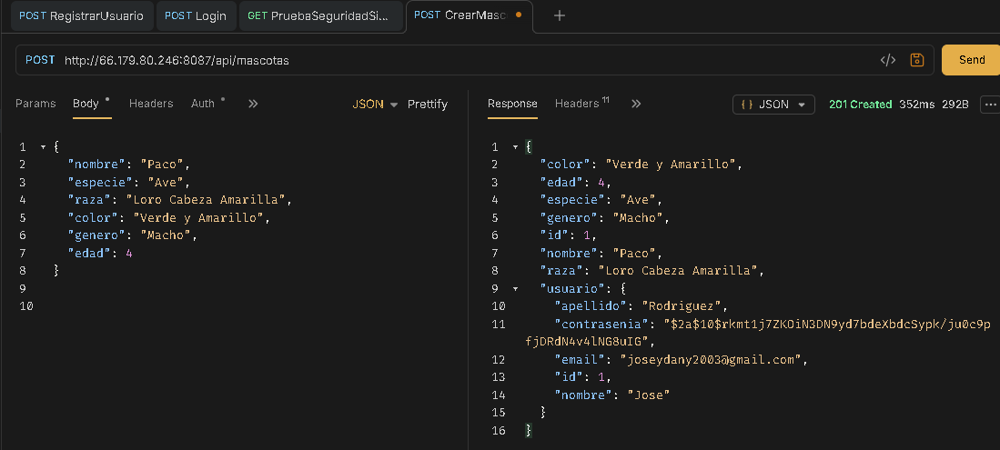
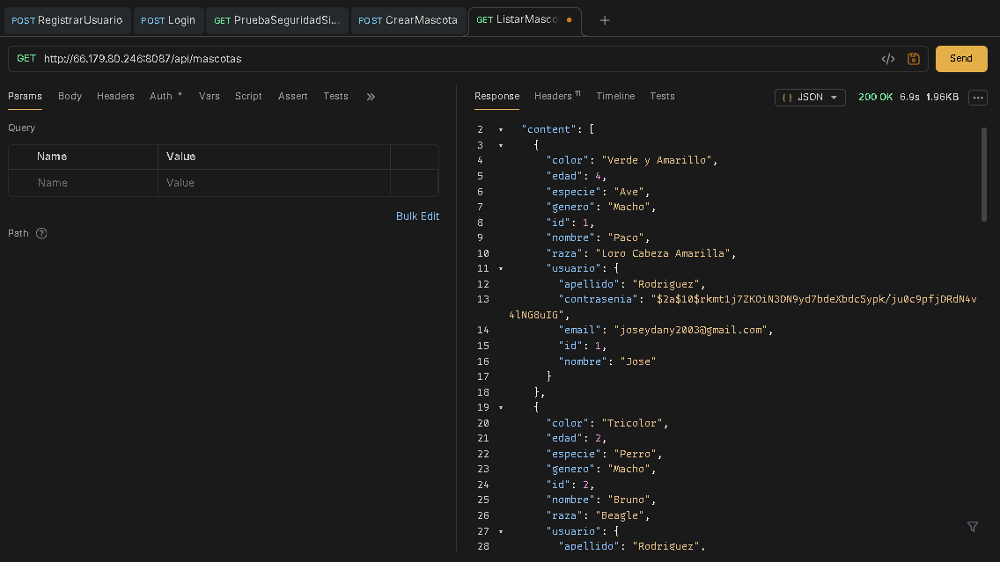
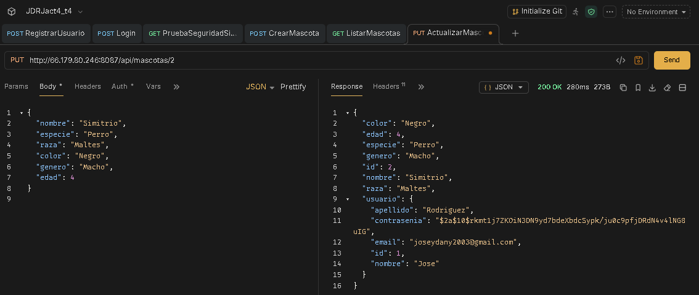
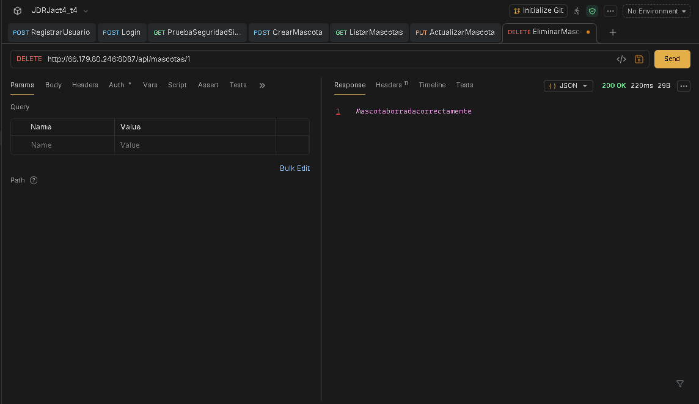
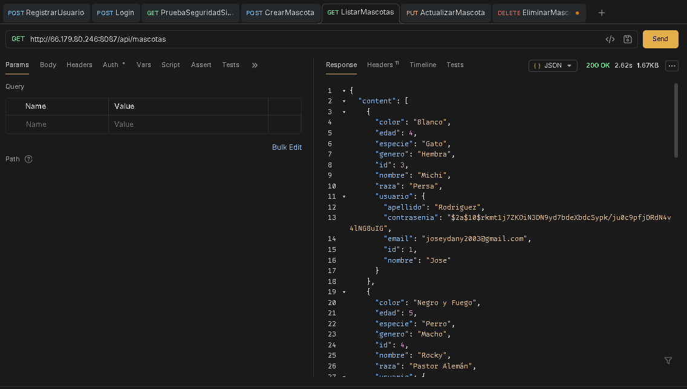
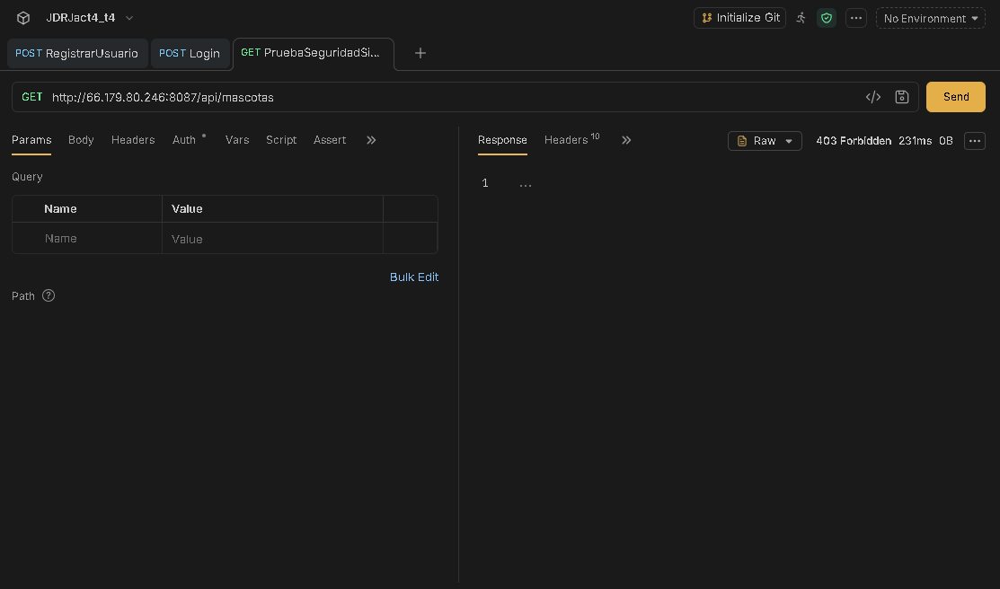

# Act4. API REST con Spring Boot, Spring Security y JWT : API REST de Mascotas

* **Institución:** Instituto Tecnológico de Oaxaca
* **Carrera:** Ingeniería en Sistemas Computacionales
* **Materia:** Programación Web
* **Estudiante:** Rodriguez Juarez Jose Daniel
* **No.Control:** 22161222
* **Grupo:** 7SC
* **Profesor:** Adelina Martinez Nieto

**Enlaces de prueba en vivo (VPS):**

* **Autenticación:**
  * **Registro:** POST `http://66.179.80.246:8087/api/auth/register`
  * **Login:** POST `http://66.179.80.246:8087/api/auth/login`
* **Mascotas:**
  * **Crear Mascota:** POST `http://66.179.80.246:8087/api/mascotas`
  * **Listar Mascotas:** GET `http://66.179.80.246:8087/api/mascotas`
  * **Obtener Mascota por ID:** GET `http://66.179.80.246:8087/api/mascotas/{id}`
  * **Actualizar Mascota:** PUT `http://66.179.80.246:8087/api/mascotas/{id}`
  * **Eliminar Mascota:** DELETE `http://66.179.80.246:8087/api/mascotas/{id}`

---

## Descripción del Proyecto
Este proyecto consistio en construir una API REST  con Spring Boot para la gestión de mascotas, incluyendo autenticación y autorización mediante JWT.

## Endpoints y Pruebas (Realizadas en Bruno)

### 1. Registro de usuario
Permite registrar un nuevo usuario en la plataforma.

### 2. Inicio de sesión (Login)
Permite a un usuario autenticarse y obtener su token JWT.

### 3. Crear mascota
Endpoint protegido que permite al usuario autenticado registrar una nueva mascota.

### 4. Listar mascotas
Obtiene la lista paginada de mascotas pertenecientes al usuario autenticado.

### 5. Actualizar mascota
Permite modificar los datos de una mascota existente perteneciente al usuario.

### 6. Eliminar mascota
Elimina una mascota especificada por su ID.

### 7. Verificación post-eliminación
Comprobación de que la mascota eliminada ya no aparece en el listado.

### 8. Prueba de seguridad (Sin token)
Verificación de que los endpoints protegidos rechazan peticiones sin un token válido, devolviendo un error 403 Forbidden o 401 Unauthorized.

---

## Flujo de Datos y Arquitectura de la Aplicación

La aplicación está construida utilizando una arquitectura por capas típica de Spring Boot, lo que asegura una clara separación de responsabilidades. El flujo de datos a través de la aplicación funciona de la siguiente manera:

1. **Cliente (Petición HTTP):**
   * El cliente (como Bruno, Postman o una interfaz Frontend) envía una petición HTTP hacia los endpoints expuestos (`/api/auth/*` o `/api/mascotas/*`).
   * Para los endpoints protegidos, el cliente debe incluir el token JWT en el encabezado `Authorization: Bearer <token>`.

2. **Capa de Seguridad (Filtros e Interceptores):**
   * La petición llega primero a la configuración de seguridad (`SecurityConfig`).
   * El filtro `JwtRequestFilter` intercepta la petición:
     * Si no requiere autenticación (ej. login/registro), permite el paso directo.
     * Si requiere autenticación, extrae y valida el JWT utilizando `JwtUtil`.
     * Si el token es válido, carga los detalles del usuario y establece la autenticación en el contexto de seguridad de Spring (`SecurityContextHolder`).

3. **Capa de Controladores (Controllers):**
   * Puntos de entrada como `AuthController` o `MascotaController` reciben la petición ya validada.
   * Se encargan de validar los datos de entrada (Payload/DTOs) y de invocar a la capa de servicio correspondiente.

4. **Capa de Lógica de Negocio (Services):**
   * Las clases de servicio ejecutan la lógica de negocio de la aplicación.
   * Manejan la relación entre usuarios y sus entidades (por ejemplo, asegurando que un usuario solo pueda modificar o consultar sus propias mascotas).
   * Actúan como intermediarios procesando los datos antes de enviarlos a la base de datos o antes de retornarlos al controlador.

5. **Capa de Acceso a Datos (Repositories):**
   * Las interfaces de repositorio (que extienden de `JpaRepository` o similar).
   * Traducen las operaciones de la lógica de negocio a consultas SQL a través de Hibernate/JPA.
   * Interactúan directamente con la base de datos para realizar operaciones CRUD (Crear, Leer, Actualizar, Eliminar).

6. **Base de Datos:**
   * Almacena de manera persistente la información de las tablas principales (como `usuarios` y `mascotas`), manteniendo la integridad referencial y el estado del sistema.

7. **Respuesta al Cliente (Response):**
   * El resultado fluye en sentido inverso: Base de Datos -> Repositorio -> Servicio -> Controlador.
   * El Controlador serializa los datos resultantes a formato `JSON` y devuelve la respuesta HTTP con el código de estado adecuado (200 OK, 201 Created, 403 Forbidden, 404 Not Found, etc.) hacia el cliente.

